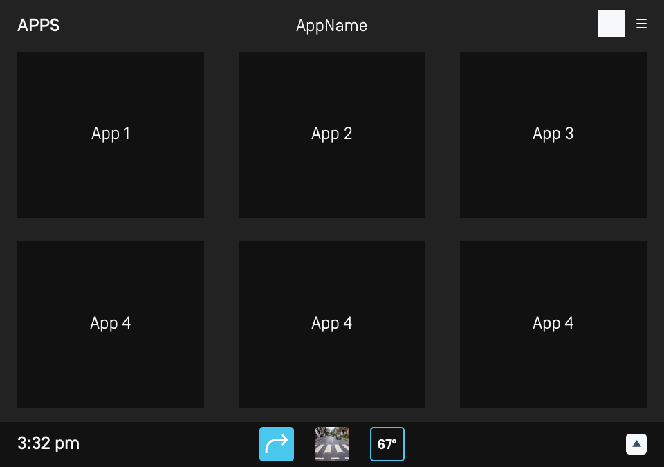
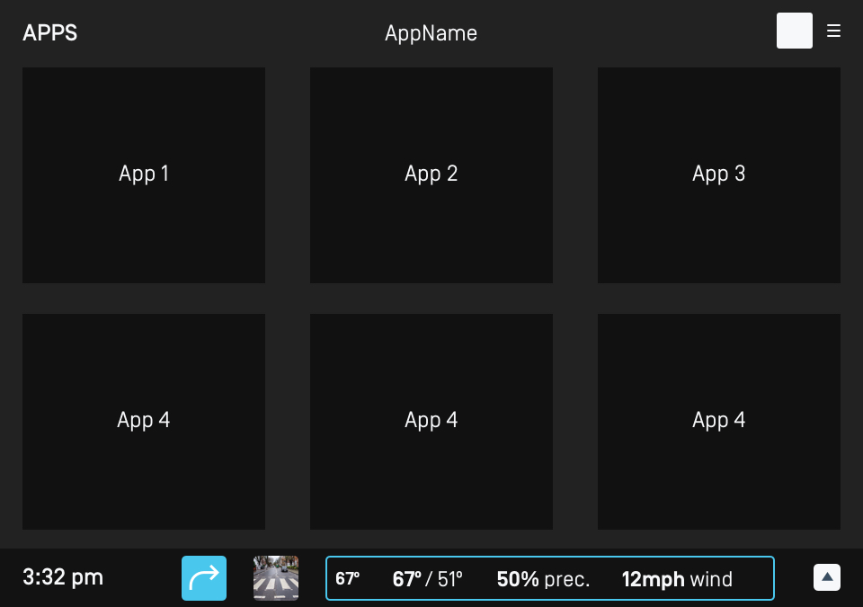
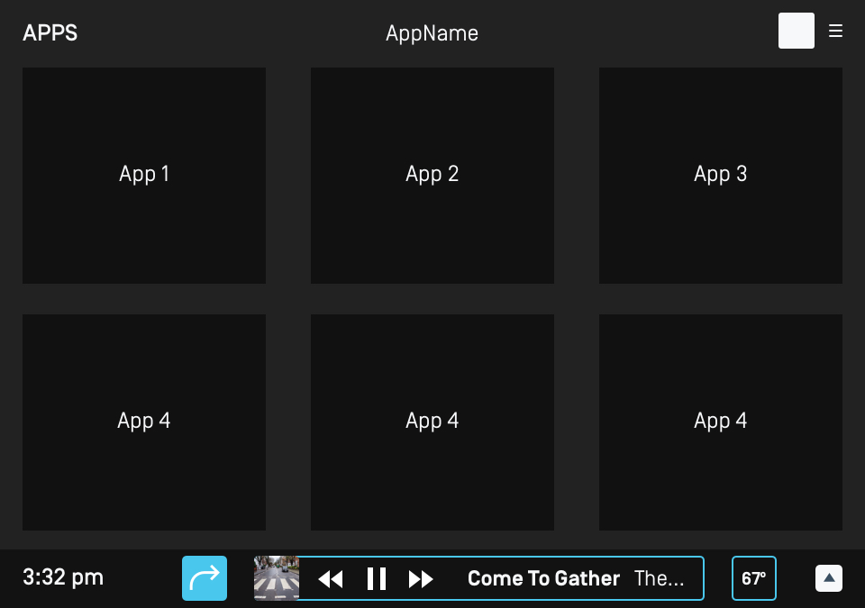
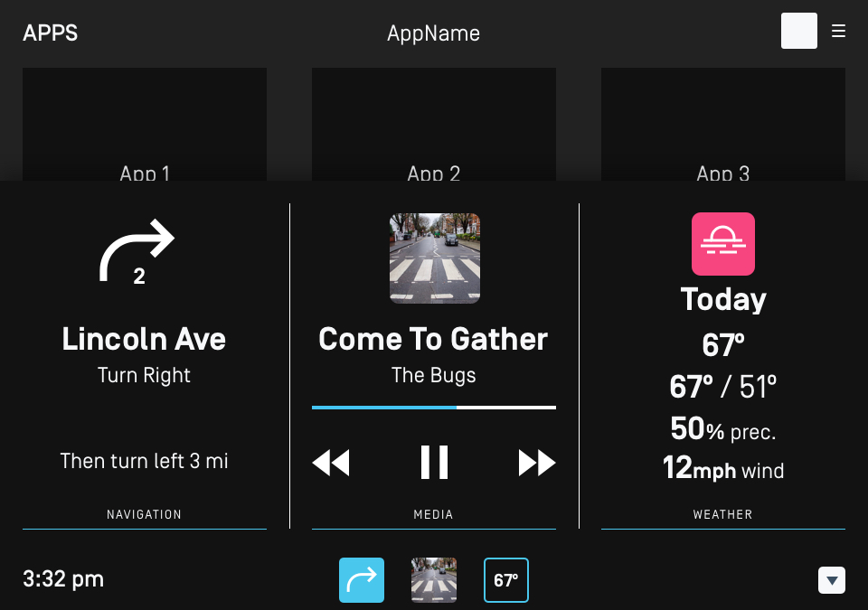

# App Services

#### Related Evolution Proposals

- [0167 App Services](https://github.com/smartdevicelink/sdl_evolution/blob/master/proposals/0167-app-services.md)
- [0223 Add Currently Playing Media Image to MediaServiceData](https://github.com/smartdevicelink/sdl_evolution/blob/master/proposals/0223-media-service-image.md)
- [0225 Update Published App Services ](https://github.com/smartdevicelink/sdl_evolution/blob/master/proposals/0225-update-published-app-services.md)
- [0239 Media Service Data Progress Bar Improvements](https://github.com/smartdevicelink/sdl_evolution/blob/master/proposals/0239-media-service-data-progress-bar-improvements.md)

## Overview

App Services are a way for apps to offer augmented services to both the onboard embedded system and also to other SDL connected apps. The data sent using this feature is specific based on the app service type. This gives the app service consumer the necessary context for them to build experiences using that data. It also allows them to be prepared to work with many different app providers of the same app service type without having to create unique integrations with each of their services. 

## Available App Service Types

The defined and supported app types as of writing this guide are:

- [Media](https://github.com/smartdevicelink/rpc_spec#mediaservicedata)
- [Weather](https://github.com/smartdevicelink/rpc_spec#weatherdata)
- [Navigation](https://github.com/smartdevicelink/rpc_spec#navigationservicedata)

For the up-to-date list, the [`AppServiceType`](https://github.com/smartdevicelink/rpc_spec#appservicetype) enum in the RPC spec can be used as reference.

### Future App Service Types

The current list of app services is by no means the only services that will ever be available. These services are just the first round of types to be added for their familiarity and usefulness in terms of creating an in-car user experience. As new services become available head units with old versions of SDL Core can still manage the publishing and subscription of those services using the new types. While the module will not be able to make use of the new service, other SDL connected applications can access them as they become defined in the RPC spec and are made available in apps.

## App Service Providers

An app service provider is the originator of a service that provides updates of related service data. For example, a connected music player application can be a Media Service or an embedded Navigation app can be a Navigation Service. Therefore an app service provider can live on either side of the SDL connection, core or application library side.

It is up to each app to decide if they wish to expose their service or not. It is not a requirement for apps to do so. 

### Request an Action be Taken by an App Services Provider

There are a few ways in which an app service provider may grant control over its features. The first is through regular SDL RPCs. The SDL Core project has the ability pass certain RPCs to app service providers when they make sense in terms of the app service type's context. For example, the `SendLocation` RPC is used by the navigation system to add as a destination or waypoint. If a different app other than the embedded navigation system is acting as the active app service, that RPC should be routed there. This allows users to bring in their apps that take the place of built-in services, but allow other apps who interact with those system to continue using their same RPCs and expect similar functionality. This type of action happens passively to both consumer and producers.

The second method to access control of the app service provider is through the `PerformAppServiceInteraction` RPC. This RPC will require the app consumer to have a closer relationship to the app service provider as it will use specific URIs that the provider recognizes. It enables providers to expose a greater feature set to app service consumers without the need of SDL RPC spec modifications and updated SDL Core implementations. App service providers are not required to implement this feature, nor are they required to honor a request. They are expected to reply to the request though. See [the RPC spec](https://github.com/smartdevicelink/rpc_spec#performappserviceinteraction) for more information.

## App Service Consumers

An app service consumer retrieves and can subscribe to updates of service data that is provided by an app service provider. For example, the module side with SDL Core could use the media app service data from a music player app to place that information outside the standard SDL "app screen" templates.

A connected SDL app could retrieve navigation app service data from the embedded navigation app service to determine the best place to fill up the car with gas and then display that information in their SDL "app screen."

### Consuming App Service Data on the Module

The main use case for using app service data on the module as a consumer is to be able to present that data in a specific and predictable way. The module can maintain branding and their user experience by taking the service data and placing it outside the generic "app screen" template boxes. For example, they may populate the app service data into the places they usually populate their embedded data.

#### Example with Generic HMI

The following is an example of populating specific areas of the HMI with app service data.

##### Collapsed View

This view contains very brief info from the app service including the next navigation instruction icon from the navigation service provider, the album art of the currently playing song from a media service provider, and the current outside temperature from the weather service provider. For this user experience, tapping on a certain tile will expand that app service, and a similar gesture like double tap, long press on a tile, or tapping on the up arrow icon will explode the view into an overlay that displays more of all the service data.

 

##### Navigation Expanded

The expanded view for the navigation tile would include more specific data on the next navigation instruction including street name, the instruction type that must be take (both from the head of the `instructions` array), and the distance until that instruction must take place (`nextInstructionDistance`). 

 

##### Weather Expanded

The expanded weather view provides more information on the current conditions including the `temperatureHigh`/`temperatureLow` for the day, the chance of precipitation (`precipProbability`), and the current `windSpeed`.

 

##### Media Expanded

The expanded media view shows additional information using `mediaTitle` and `mediaArtist` while also providing basic playback controls that will send `OnButtonPress` RPCs to the app service provider.

 

##### Exploded View

The exploded view demonstrates how more information could be used from the app service providers to populate large UI elements. 

 
