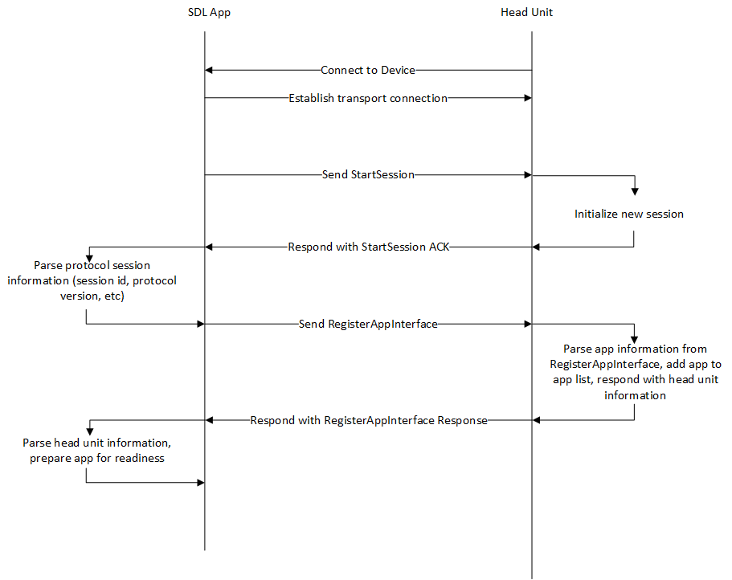
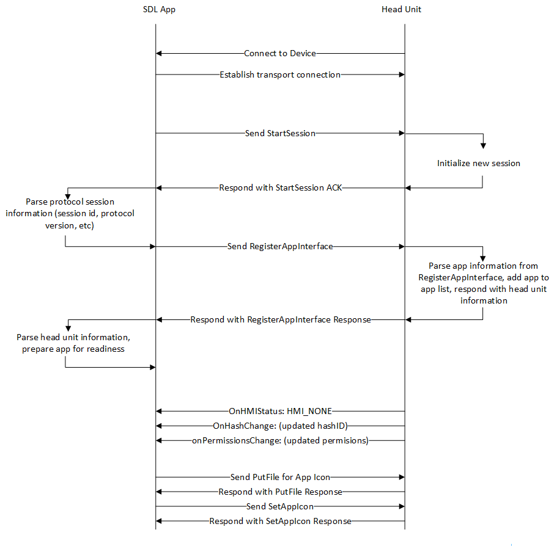

## Registering an Application

After the app starts the SDL session, it's time to send more information to the SDL core implementation that will define many more aspects about the application. The library will send a `RegisterAppInferface` RPC request to the Core implementation. What information being sent can be found [here](https://github.com/smartdevicelink/rpc_spec#registerappinterface). Core passes a lot of this information the HMI so that the HMI can present this application on an app list or similar. 

After Core and the HMI have accepted the app, Core will create a `RegisterAppInterface` response to send back to the app. This will consist of a lot of information about the system that the app library will need to know to make adjustments and adapt to this specific system. The supplied parameters can be found [here](https://github.com/smartdevicelink/rpc_spec#registerappinterface-1).

 

Once the app is registered, Core usually sends a few more notifications to the app. These include an OnHMIStatus, OnPermissionChange, and onHashChange. 

#### OnHMIStatus

This is a required notification from Core to be sent to the app. This sets the basic HMI status for the app on the head unit. At this point the app knows that it registered and displayed on an app list waiting for a user to select it.

#### OnHashChange

If the implementation of Core supports hash resumption, anytime an item that can be restored with the correct hash changes this notification will be sent. Since the app just registered with information that updated the app record on Core, this notification is sent to the app. 

#### OnPermissionChange

After the app has registered, Core will check the policy table to see if the app has any permission updates. 

#### App begins sending more data

After the OnHMIStatus is received, the app will likely send a few RPCs that help get the head unit ready to display that application. The most common set of RPCs will be to set an app icon. This is done with a PutFile followed by a SetAppIcon request.

Some apps will send more RPCs at this time, but based on the policy table they might be limited to a certain number.

 
