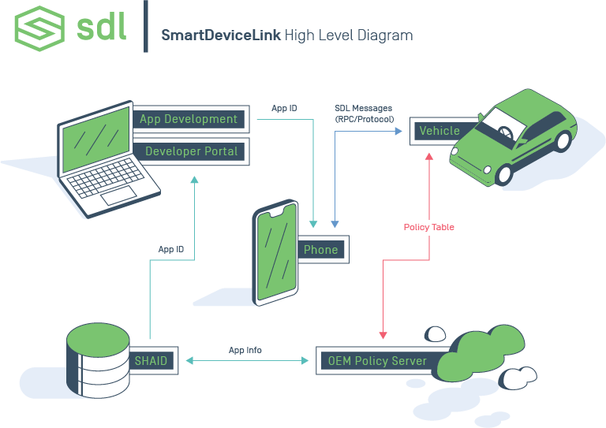

## SDL Overview Guide

This is an overview of how SmartDeviceLink (SDL) works. It will go through higher level discussions about certain aspects of SDL to give an intro level of understanding. 

SmartDeviceLink is a connectivity protocol that allows applications to communicate with cars. This allows drivers to safely access the content they want through their vehicle in safely designed manor. 

There are different components to SDL that make everything work. The following diagram shows how some of those pieces are connected. 

  
 

## Sections

### Supported Platforms

This section quickly points out which platforms for the application, Core, and HMI sides of the project can be used.

### Getting Started

The first few guides will be centered around getting SDL started. 

1. Establish a transport level connection
2. App initiates a protocol level session start, Core accepts.
3. App registers itself onto the head unit. Core responds with system information
4. Activating the App

### Protocol Spec

This section defines the lowest level of SDL. It defines how the byte level code is communicated between the application library and the head unit / Core. It contains information on what protocol level packets are used, basic handshakes, etc.

### RPC Spec

The majority of messages that get sent between the app library and head unit are of RPC messages. These messages are actually wrapped in the SDL Protocol header and format. The RPC messages contain information to perform certain actions, notify of certain events, etc. It defines much of what SDL can do.

### Best Practices

There are certain items that should be followed that aren't necessary defined as requirements. These items are shared within this section. 

### FAQ

This section covers a few of the commonly asked questions around SDL.