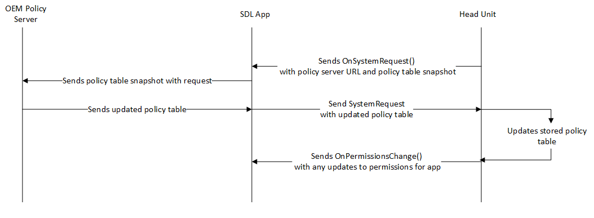

## Policies

SmartDeviceLink uses a robust message checking system that allows OEMs to control exactly what information can be sent to and from an app. This allows the OEM to still be in control of their data and make the choices of who gets access to it while still being able to allow access when it makes sense. The biggest feature of policies is to disallow certain requests from the application when they are not allowed while still being able to allow other apps to use the same RPCs. It can also be as granular as specifying which parameters can be accepted for messages; this is very useful when retrieving vehicle data as policies can specify exactly which data sets (RPM, PRNDL, etc) apps have access.

Why is this type of control useful? Let's examine an app's ability to use the Alert RPC. While an app is in the background or hasn't been activated by a user yet, it should not have the ability to successfully send an alert RPC that will likely appear as an overlay. 

While this could be a simple check hardcoded into Core, it might also make sense that some apps are allowed to have such behavior. By creating different functional groups and assigning those to specific apps, Core can have dynamic behavior for each app. 

For more information on the example policy server check [here](https://smartdevicelink.com/en/guides/sdl-server/overview/).

### Common Use Cases

- Vehicle Data Access 
- Remote Control
- Number of messages sent before app is activated
- Default HMI status for apps on register
- Including SDL related strings that will be displayed to the user; includes translations

### Policy Table Updates

Beyond simply just hardcoding behaviors, it is also not expected that the app specific behaviors be static as well. Policy tables are made to be updated. This process can happen a few different ways, but the most common is leveraging the connected application to retrieve and pass the policy table.

 

#### Policy Update Triggers

There are certain events that will trigger Core to request a new, updated policy table. Here are a few:

- A new, unrecognized app connects
- After a set expiration date
- "x" number of ignition cycles have happened

