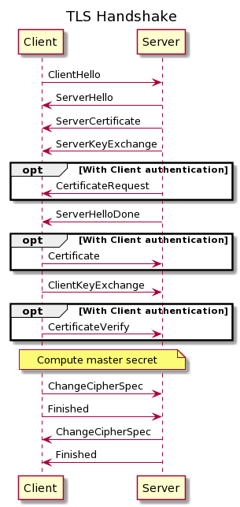

# Protected Services

#### Related Evolution Proposals
- [0317: SDL Protocol Security Specification](https://github.com/smartdevicelink/sdl_evolution/blob/master/proposals/0317-sdl-protocol-security-specification.md)

## 1. Overview

Secured services in SDL are established using a TLS handshake, the TLS handshake process is defined by TLS and is not part of the SDL protocol.

|||
TLS Handshake Process

|||

## 2. Peer roles during the handshake

The handshake for establishing secured services uses a client-server model which is configurable via SDL Core settings. An application must take the role of the server while SDL Core is the client. The client entity will initiate a TLS handshake with the corresponding security manager of the server. The client will do this only if the server was not previously authenticated in the current transport connection.

### 2.1 Peer certificate verification

According to the TLS handshake process, the peer certificate can be omitted for the server but is required for the client. Certificate peer verification can be enabled/disabled in SDL Core by changing the `VerifyPeer` parameter in the configuration file. The SDL app libraries do not require a certificate from Core for the TLS handshake, but Core does perform its own internal certificate validation before starting the handshake. During internal validation, Core checks if the certificate is missing (or outdated/invalid) and if so, it initiates a PTU to obtain a new certificate from the Policy Server. If a valid certificate can't be obtained, Core does not start the TLS handshake and it notifies the app library that starting the protected service has failed.

## 3. RPC processing
After [RPC service encryption](../rpc-encryption) is enabled, SDL Core will reject any unencrypted RPC requests with an unencrypted response and result code `ENCRYPTION_NEEDED` if the RPC needs protection.

!!! NOTE

- SDL Core continues processing an unencrypted RPC request if the RPC does not need protection and responds with an unencrypted response.

- SDL Core continues processing an encrypted RPC request if the RPC needs protection and responds with an encrypted response. In addition, SDL Core shall continue processing an encrypted RPC request if the RPC does not need protection and responds with an encrypted response.

- SDL Core sends an unencrypted notification if the RPC does not need protection.  

- SDL Core sends an encrypted notification if the RPC needs protection.

!!!
